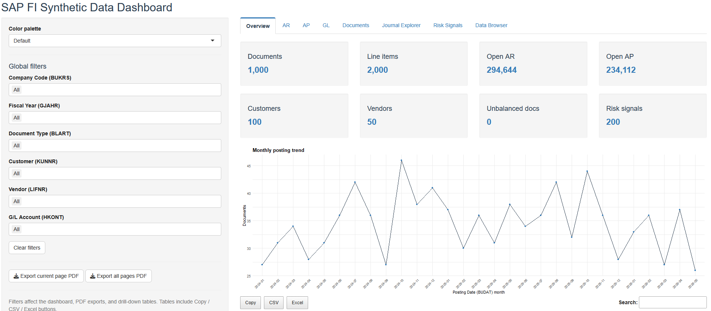

# SAP Synthetic FI Data Generator

**R + SQLite toolkit** for generating safe, PII-free, SAP-style synthetic Finance data and exploring it through a Shiny dashboard.

The project creates a local synthetic SAP FI sandbox covering:

- **Accounts Receivable (AR)**: customer invoices, open items, cleared items, aging and customer exposure.
- **Accounts Payable (AP)**: vendor invoices, open items, cleared items, aging and vendor exposure.
- **General Ledger (GL)**: balanced FI documents, G/L line items, account composition and journal drill-down.
- **Risk signals**: simple accounting analytics checks such as large documents, weekend postings and round-number items.



> This is **SAP-style synthetic data**, not an official SAP extract. It uses familiar SAP technical table and field names so the project feels close to FI reporting and analytics work while remaining fully synthetic.

---

## Features

- Generates balanced SAP-style FI documents into SQLite.
- Uses SAP-like technical tables: `BKPF`, `BSEG`, `BSID`, `BSAD`, `BSIK`, `BSAK`, `BSIS`, `BSAS`, `ACDOCA`.
- Includes master data for companies, customers, vendors and G/L accounts.
- Provides a Shiny dashboard with AR, AP, GL, Documents, Journal Explorer, Risk Signals and Data Browser tabs.
- Supports global dashboard filters, color palette selection, PDF export and table export to CSV/Excel.
- Includes a basic EDA script for CSV summaries and static chart artifacts.
- Fully reproducible through seeded data generation.

---

## Repository layout

```text
SAP-Synthetic-Data-Generator/
├─ R/
│  ├─ cli.R          # Command-line entry point: init-db, generate, smoke-test
│  ├─ schema.R       # SQLite schema definition
│  ├─ generate.R     # Synthetic SAP FI data generation logic
│  ├─ analysis.R     # Basic EDA exports
│  └─ app.R          # Shiny dashboard
├─ data/
│  └─ sap_fi.sqlite  # Local generated DB
├─ outputs/
│  ├─ eda/           # Generated EDA CSV/PNG outputs
│  └─ dashboard/     # Selected dashboard screenshots
├─ README.md
└─ .gitignore
```

---

## SAP-style table coverage

| Area | Tables | Purpose |
|---|---|---|
| Company / chart setup | `T001`, `SKA1`, `SKB1` | Company codes and G/L account master data |
| Customers / AR master | `KNA1`, `KNB1` | Customer general and company-code data |
| Vendors / AP master | `LFA1`, `LFB1` | Vendor general and company-code data |
| FI documents | `BKPF`, `BSEG` | Accounting document header and line-item data |
| AR indexes | `BSID`, `BSAD` | Customer open and cleared items |
| AP indexes | `BSIK`, `BSAK` | Vendor open and cleared items |
| GL indexes | `BSIS`, `BSAS` | G/L open and cleared items |
| S/4HANA-style journal | `ACDOCA` | Simplified Universal Journal-like line items |

---

## Quickstart

### 1. Install R packages

```r
install.packages(
  c("DBI", "RSQLite", "shiny", "dplyr", "ggplot2", "DT", "scales"),
  repos = "https://cloud.r-project.org"
)
```

### 2. Initialize SQLite schema

```bash
Rscript R/cli.R init-db --db=data/sap_fi.sqlite
```

### 3. Generate synthetic data

```bash
Rscript R/cli.R generate \
  --db=data/sap_fi.sqlite \
  --n-customers=1000 \
  --n-vendors=750 \
  --n-gl-accounts=25 \
  --n-documents=20000 \
  --seed=42
```

### 4. Smoke test

```bash
Rscript R/cli.R smoke-test --db=data/sap_fi.sqlite
```

### 5. Run basic EDA

```bash
Rscript R/analysis.R --db=data/sap_fi.sqlite --out=outputs/eda
```

### 6. Launch the Shiny dashboard

```bash
Rscript -e "shiny::runApp('R/app.R', launch.browser = TRUE)"
```

---

## Dashboard pages

| Tab | Purpose |
|---|---|
| Overview | High-level document, line item, AR/AP and risk KPIs |
| AR | Open AR aging, top customers and customer exposure |
| AP | Open AP aging, top vendors and vendor exposure |
| GL | G/L open items, debit/credit amounts and account composition |
| Documents | Document type mix, debit/credit check and unbalanced document QC |
| Journal Explorer | Select one accounting document and inspect header + line items |
| Risk Signals | Large documents, weekend postings and other simple risk checks |
| Data Browser | Table dictionary and SAP-style table browsing |

---

## Data generation logic

Each generated FI document is balanced and written to:

1. `BKPF` header.
2. `BSEG` line items.
3. One or more secondary index tables:
   - `BSID` / `BSAD` for AR customer lines.
   - `BSIK` / `BSAK` for AP vendor lines.
   - `BSIS` / `BSAS` for GL lines.
4. `ACDOCA` simplified S/4HANA-style journal lines.

Default document mix:

- AR invoices: `BLART = DR`
- AP invoices: `BLART = KR`
- GL journals: `BLART = SA`

Clearing status is synthetic. Cleared documents receive `AUGBL` and `AUGDT`; open documents remain in the relevant open-item table.

---

## Ethics

This project generates **100% synthetic data**. It contains no real customers, vendors, invoices, tax IDs, company records or SAP system extracts.

The purpose is safe portfolio work, analytics prototyping, dashboarding, FI data-model learning and reproducible data engineering practice.
